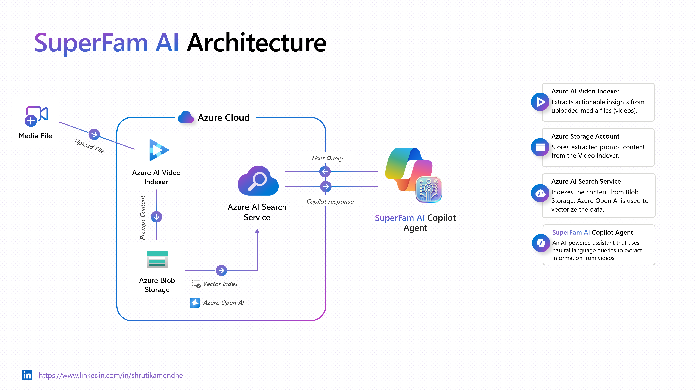
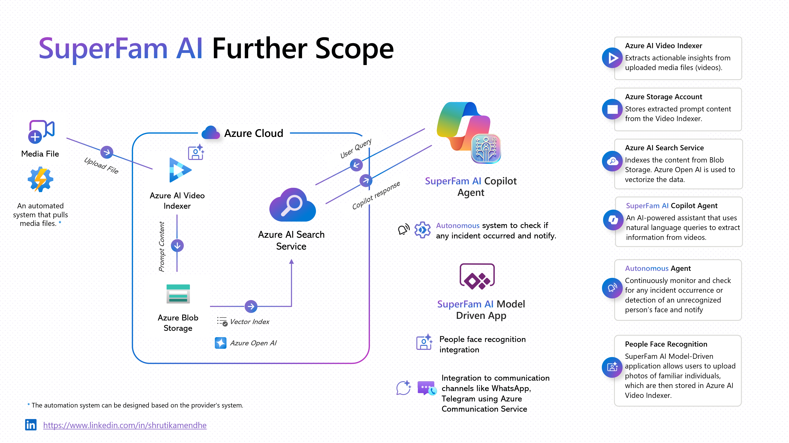
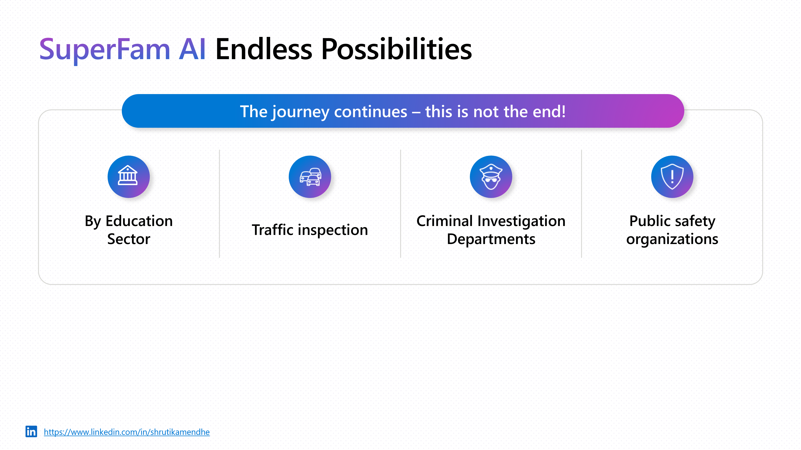
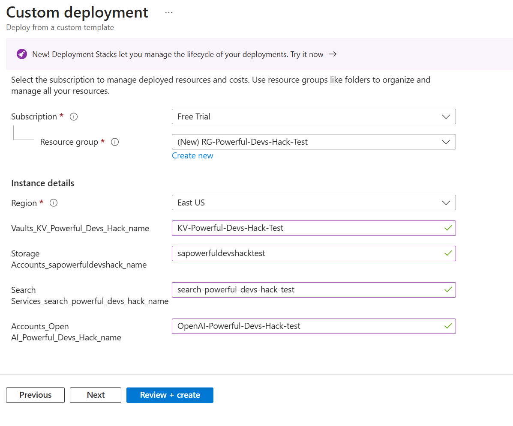
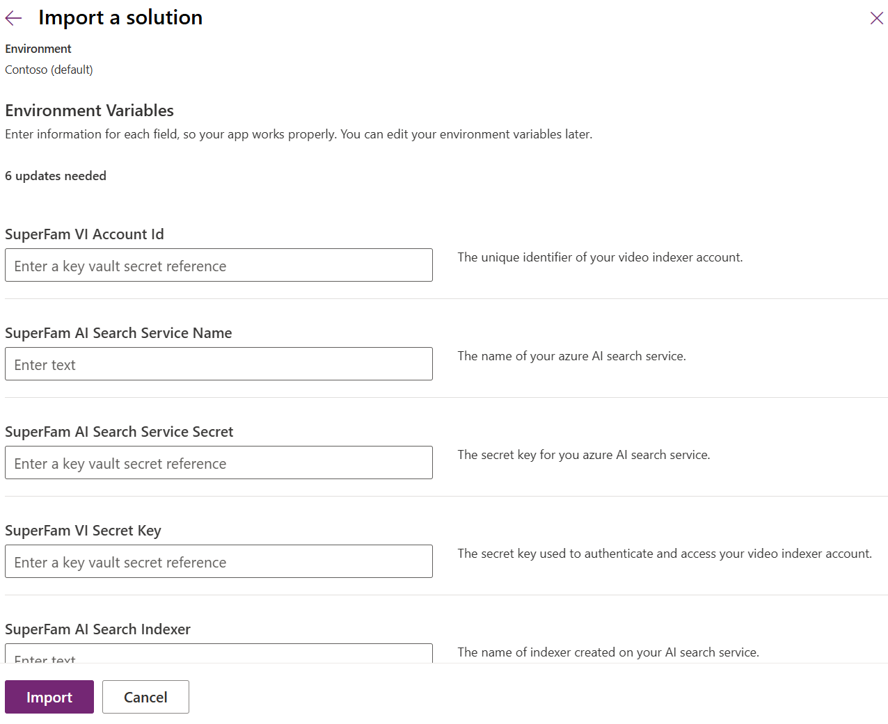
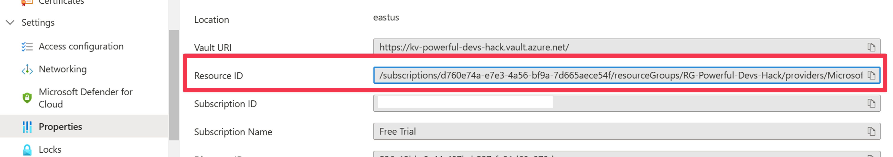
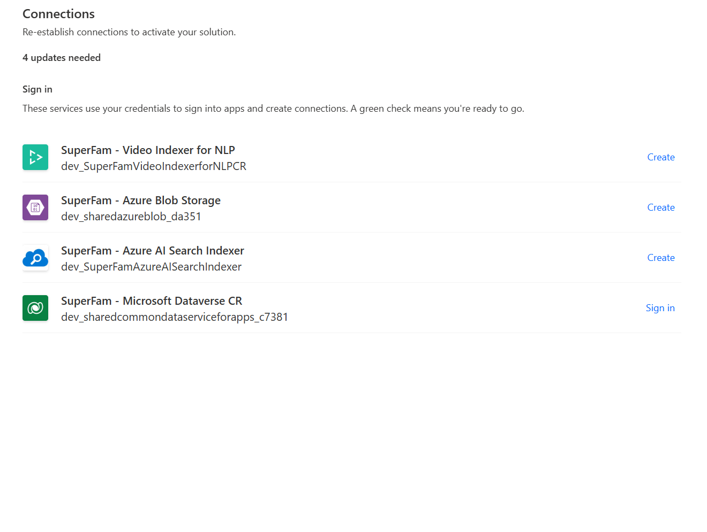

# SuperFam AI - Your Intelligent Assistant for the Super Family

## Introduction
In today’s fast-paced world, juggling work, family, and personal responsibilities can be overwhelming—especially for busy parents who want to stay informed about their children’s daily routines. SuperFam AI is an intelligent Power Platform Copilot agent designed to simplify this process by allowing users to query security camera video recordings with natural language to quickly locate specific events or activities.

With SuperFam AI, parents can effortlessly find key moments—such as checking when their child arrived home, identifying any unusual incidents, or reviewing daily routines—without manually sifting through hours of footage. The AI-powered query system understands everyday language, making video surveillance more accessible and efficient.

## Architecture Overview
The architecture of SuperFam AI is designed to be modular and scalable. Below is the architecture diagram that provides an overview of the system components and their interactions.

## Further Scope

The scope of SuperFam AI is not limited to the current features. The following implementations are planned:

- **Integration with Security Smart Home Devices**: Expand the system to interact with security smart home devices for a more comprehensive monitoring solution.
- **Real-time Alerts**: Continuously monitor and check for any incident occurrence or detection of an unrecognized person’s face and notify.
- **People Face Recognition**: Interface to allow users to upload photos of familiar individuals, which are then stored in Azure AI Video Indexers.
- **Mobile Application**: Integration with communication channels like WhatsApp, Telegram using Azure Communication Service.

## Scalability Vision

SuperFam AI goes beyond just family monitoring. Its advanced AI-driven capabilities can be adapted for multiple industries, making it a versatile solution across different sectors. Whether it’s traffic inspection, criminal investigation departments, or public safety organizations, SuperFam AI leverages real-time data processing, automation, and AI analytics to support decision-making and enhance security.

## Security
The solution is architected with **secure-by-design principles** and **follows industry-leading security best practices** to ensure data privacy, integrity, and access control at every step.

1. **Vault-Driven Data Protection**
All sensitive information, including API keys, access credentials, and configurations, is securely stored and managed using **Azure Key Vault** — providing end-to-end encryption and protecting data from unauthorized access.

2. **Environment Variable Shielding**
System environment variables are referred from Key Vault services rather than hard-coded text configurations, ensuring no sensitive data is exposed at any layer of the application.

3. **Secure Custom Connectors**
Every custom connector is designed with built-in security layers, fetching values exclusively from protected environment variables to avoid direct data exposure and ensure zero-trust data flow across services.

4. **Authentication in Custom Connectors**
Custom connectors strictly follow OAuth 2.0 protocols and API authentication best practices, ensuring that no data or service is accessible without verified user credentials.

5. **Temporary Access Tokens**
To reinforce session security, temporary access tokens are generated via supporting flows for video queries through Azure Video Indexer. These tokens are valid for only 1 hour, automatically expiring to prevent misuse and unauthorized replays.

## Prerequisites

To get started with SuperFam AI, ensure you have the following prerequisites:

- **Azure Subscription**: An active Azure subscription is required. You can sign up for a free trial if you don't have one.
- **Azure AI Vision Service Account**: Set up an Azure AI Vision service account, at least a trial version, to utilize AI capabilities.
- **Power Platform Instance**: A Power Platform instance with Copilot enabled to host and interact with the AI Agent.

## Deploy Azure Resources

To deploy the required Azure resources using the Azure Portal, follow these steps:

1. In a web browser, go to the [Azure portal](https://portal.azure.com/) and sign in.
2. From the Azure portal search bar, search for **Deploy a custom template** and then select it from the available options.
    
3. Select **Build your own template** in the editor.
    
4. You will see a blank template.
    
5. Replace the blank template with the JSON provided in [template.json](./Packages/Azure%20Resources/template.json) and hit *Save*.
6. Remove and update all the resource names and click **Review + create**. Then click **Create**.
    
7. Wait for the deployment to complete.

## Importing Prerequisites Solution
The prerequisite solution contains all the custom connectors and the environment variables needed by the SuperFam AI solution.

1. Download and import the SuperFamAIPrerequisites_1_0_0_0_managed.zip solution from [SuperFam AI Prerequisites](./Packages/Power Platform/SuperFamAIPrerequisites_1_0_0_0_managed.zip).
2. It will ask you to configure environment variables.
    
3. Provide the value of Azure AI Search Service and Search Indexer directly as it's plain text.
4. To generate the value for secret-type environment variables, navigate to the Azure Portal and go to the KeyVault resource.
5. Go to Properties and copy the value of **Resource ID**.
    
6. Now the value of individual secret keys needs to be passed in the following format:
    [Resource ID]/secrets/[SecretName]
7. Provide the Secret Name from the KeyVault service and pass the environment variables.
8. Click on Next and deploy the solution.

## Importing SuperFam AI Solution
This solution contains the PowerAutomate flows that are needed to prepare the Database and the Copilot Agent itself.

1. Download and import the SuperFamAI_1_0_0_0_managed.zip solution from [SuperFam AI Solution](./Packages/Power Platform/SuperFamAI_1_0_0_0_managed.zip).

2. You will be asked to connect. 
    

3. Click on Next and wait until the solution is imported.

## Preparing Database

To prepare the database, follow these steps:

1. **Import Sample Data**: Import sample data from the `Samples` folder or use your own videos. Upload these videos to your Azure AI Video Indexer account manually, as the current system does not support automated uploads.

2. **Run PrepareDB PowerAutomate Flow**:
    - Navigate to the **SuperFam AI** solution and locate the `SuperFam - Prepare Video DB` Power Automate flow from the imported solution.
    - Select the flow and click on **Run** to execute it.

    This flow will process the uploaded videos and prepare the database for use with SuperFam AI Copilot agent.

3. **Check and Add Azure AI Search knowledge**:
    - Ensure that the Azure AI Search knowledge is correctly configured in the SuperFam AI Copilot agent. If it's not, then it to the agent.

Now, the SuperFam AI is ready to use. In Copilot Studio, click on Test and try out to search in the videos.
